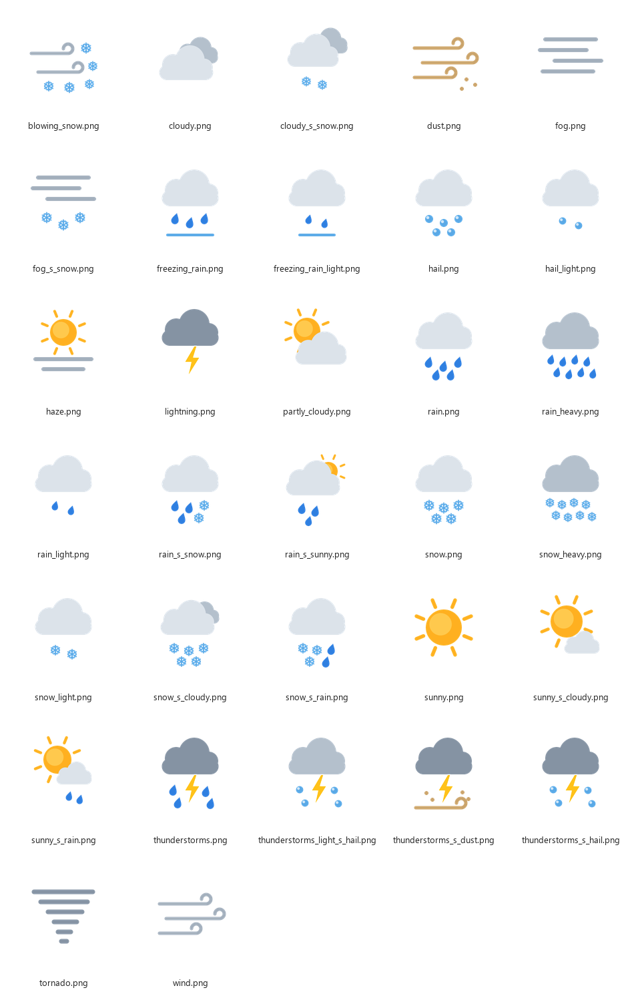

# Weather Icons

A set of 21 flat weather icons mapped to the WMO weather interpretation codes (WMO code table 4677, the subset used by Open-Meteo's `weather_code`). The icons are drawn from scratch by the script in `scripts/`, so they carry no third-party artwork.



## What's in the repo

| Path | Contents |
|---|---|
| `wmo_weather_icons.csv` | Lookup dataset: `wmo_code`, `weather_description`, `weather_icon_url` (28 rows) |
| `png/` | 256×256 PNGs with transparent backgrounds |
| `svg/` | The same icons as scalable SVGs |
| `scripts/make_icons.py` | Generator script: palette, shapes and code-to-icon composition |
| `docs/preview_sheet.png` | Contact sheet of every icon |

## Code mapping

| WMO code | Description | Icon |
|---|---|---|
| 0 | Sunny | `sunny` |
| 1 | Mainly Sunny | `sunny_s_cloudy` |
| 2 | Partly Cloudy | `partly_cloudy` |
| 3 | Cloudy | `cloudy` |
| 45 | Foggy | `fog` |
| 48 | Rime Fog | `fog_s_snow` |
| 51 | Light Drizzle | `rain_light` |
| 53 | Drizzle | `rain_light` |
| 55 | Heavy Drizzle | `rain` |
| 56 | Light Freezing Drizzle | `rain_s_snow` |
| 57 | Freezing Drizzle | `snow_s_rain` |
| 61 | Light Rain | `rain_light` |
| 63 | Rain | `rain` |
| 65 | Heavy Rain | `rain_heavy` |
| 66 | Light Freezing Rain | `rain_s_snow` |
| 67 | Freezing Rain | `snow_s_rain` |
| 71 | Light Snow | `snow_light` |
| 73 | Snow | `snow` |
| 75 | Heavy Snow | `snow_heavy` |
| 77 | Snow Grains | `snow_light` |
| 80 | Light Showers | `sunny_s_rain` |
| 81 | Showers | `rain_s_sunny` |
| 82 | Heavy Showers | `rain_heavy` |
| 85 | Light Snow Showers | `cloudy_s_snow` |
| 86 | Snow Showers | `snow_s_cloudy` |
| 95 | Thunderstorm | `thunderstorms` |
| 96 | Light Thunderstorms With Hail | `thunderstorms_light_s_snow` |
| 99 | Thunderstorm With Hail | `thunderstorms_s_snow` |

The icons show daytime conditions only; there are no night variants.

The lighter freezing codes (56, 66) use `rain_s_snow`, with rain in front; the heavier ones (57, 67) use `snow_s_rain`, with snow in front.

## Using the dataset

### dbt seed (Snowflake)

Copy `wmo_weather_icons.csv` into your project's `seeds/` folder and pin the column types:

```yaml
# seeds/_seeds.yml
seeds:
  - name: wmo_weather_icons
    config:
      column_types:
        wmo_code: number(3,0)
        weather_description: varchar
        weather_icon_url: varchar
```

Then join it to your weather data:

```sql
select
    w.*,
    i.weather_description,
    i.weather_icon_url
from {{ ref('stg_open_meteo__daily') }} as w
left join {{ ref('wmo_weather_icons') }} as i
    on w.weather_code = i.wmo_code
```

(`stg_open_meteo__daily` is illustrative; substitute your own model.)

### Qlik Sense

```
WeatherIcons:
LOAD
    wmo_code             AS [Weather Code],
    weather_description  AS [Weather Description],
    weather_icon_url     AS [Weather Icon URL]
FROM [lib://<your-connection>/wmo_weather_icons.csv]
(txt, utf8, embedded labels, delimiter is ',', msq);
```

In a table object, set the `Weather Icon URL` column's representation to **Image** to show the icon.

### Where the URLs point

`weather_icon_url` points at the PNGs in this repo via `raw.githubusercontent.com`. **This repository is private**, so those URLs need GitHub authentication and will not load in Qlik or a browser for anyone outside the organisation. If the icons need to be publicly reachable, either host the `png/` folder somewhere public (a CDN, a public bucket, or Qlik's media library) and find-and-replace the URL prefix in the CSV, or make the repo public.

## Regenerating or restyling the icons

```bash
pip install cairosvg
python scripts/make_icons.py
```

The script writes every icon to `svg/` and `png/`. Colours are defined as constants at the top of the file (`SUN`, `CLOUD_LIGHT`, `CLOUD_MID`, `CLOUD_DARK`, `RAIN`, `SNOW`, `BOLT`, `FOG`), so a client-branded version is a matter of changing those values and re-running. Each icon is a short composition in the `icons` dictionary if you want to add or adjust one.

## Sources

- WMO codes and descriptions: stellasphere, *WMO weather interpretation code descriptions* gist — https://gist.github.com/stellasphere/9490c195ed2b53c707087c8c2db4ec0c. Descriptions are the gist's daytime wording; the icons are original to this repo.
- WMO code table 4677 reference: https://www.nodc.noaa.gov/archive/arc0021/0002199/1.1/data/0-data/HTML/WMO-CODE/WMO4677.HTM

## Licence

No licence has been applied yet. This repository is for internal Tahola use only until licensing is agreed.
